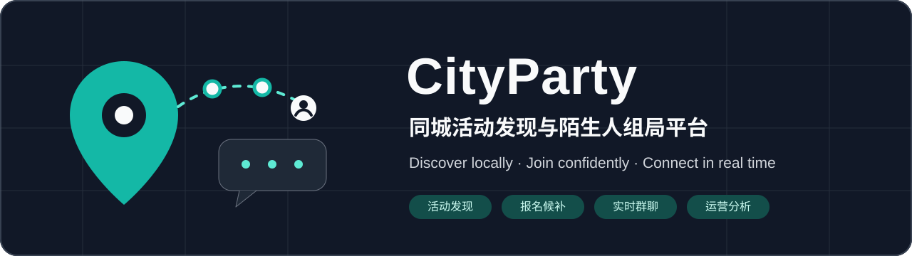
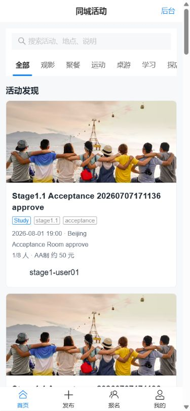
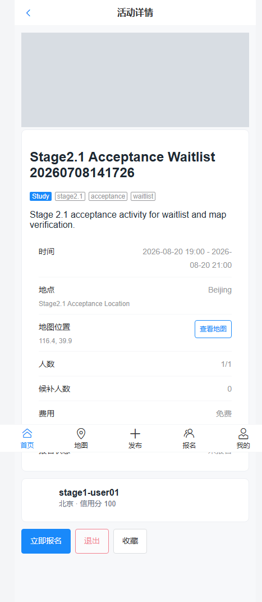
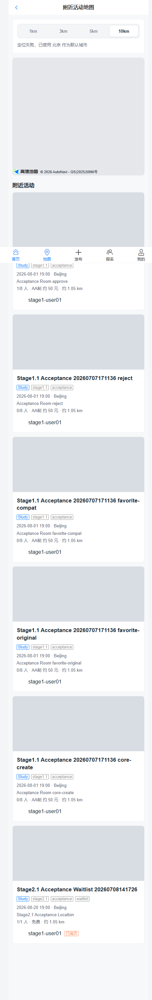
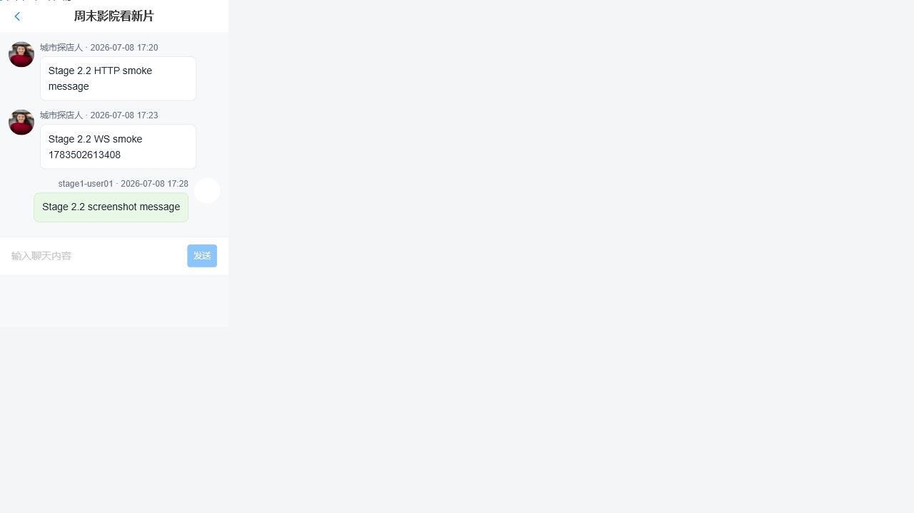
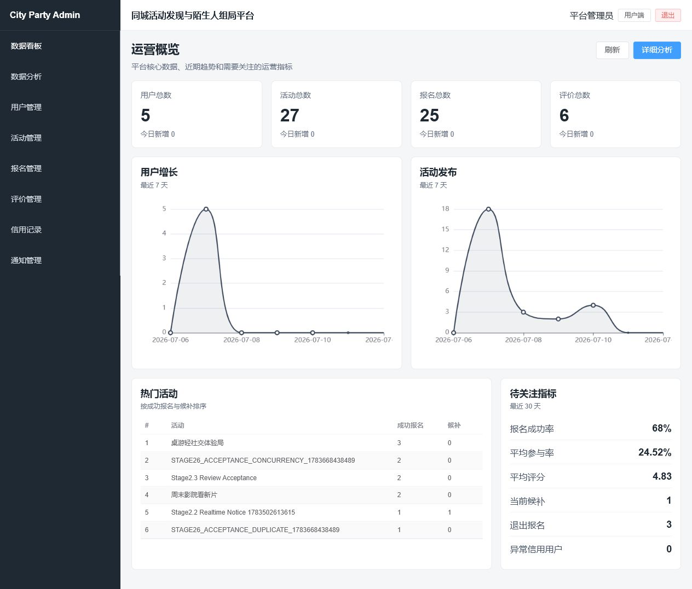
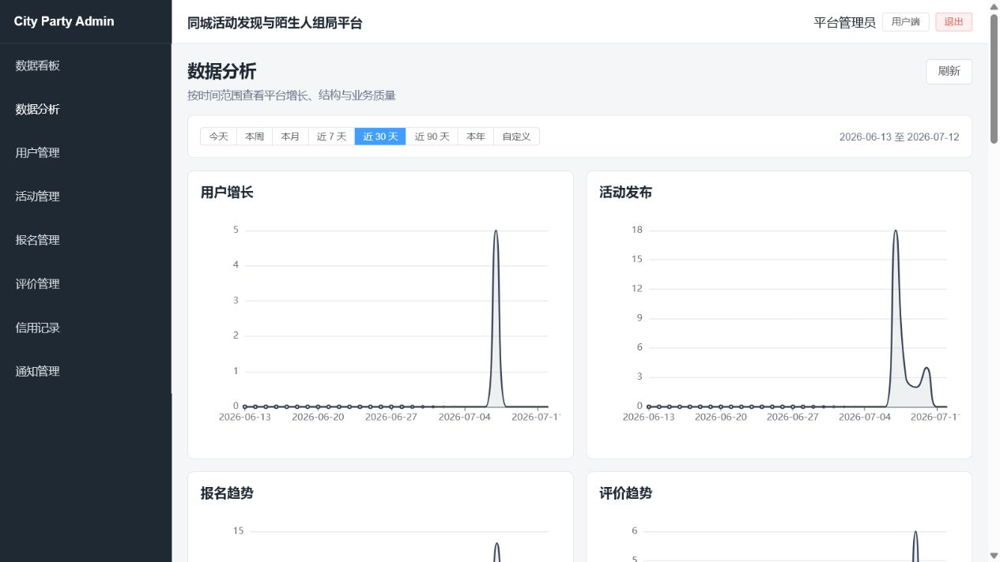
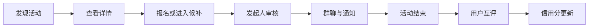
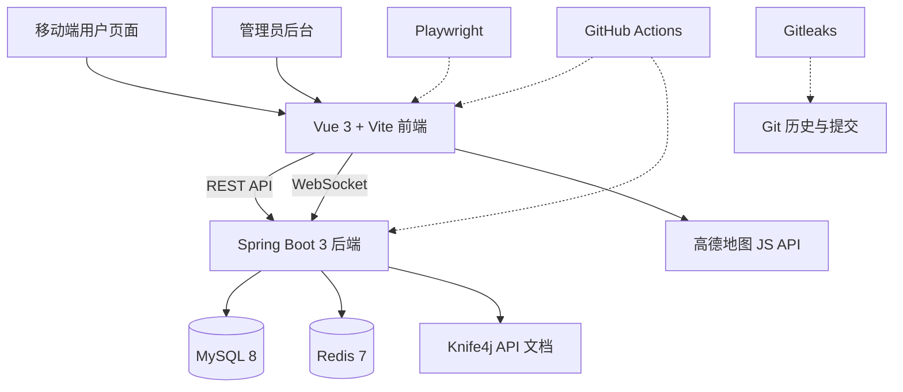

<p align="center">
  
</p>

<h1 align="center">CityParty — 同城活动发现与陌生人组局平台</h1>

<p align="center"><strong>City Activity Discovery &amp; Social Meetup Platform</strong></p>

<p align="center">
  基于 Vue 3 与 Spring Boot 构建的同城线下活动组局平台，覆盖活动发现、地图浏览、报名候补、实时群聊、互评信用与管理员运营分析等完整业务流程。
</p>

<p align="center">
  <a href="https://github.com/Cherry-zr/city-party-platform/actions/workflows/ci.yml"></a>
  <a href="https://github.com/Cherry-zr/city-party-platform/actions/workflows/security-scan.yml"></a>
  
  
  
  
</p>

<p align="center">
  <a href="#项目亮点">项目亮点</a> ·
  <a href="#功能演示">功能演示</a> ·
  <a href="#核心业务流程">业务流程</a> ·
  <a href="#技术架构">技术架构</a> ·
  <a href="#快速开始">快速开始</a> ·
  <a href="#项目文档">项目文档</a> ·
  <a href="#测试与工程质量">工程质量</a> ·
  <a href="#已知限制">已知限制</a>
</p>

> 本项目面向毕业设计、简历与全栈工程能力展示，目前提供完整的本地运行和演示流程，暂未开放公网访问，也不包含线上运营数据。

## 项目亮点

| 模块 | 实现重点 |
| --- | --- |
| 活动发现与生命周期 | 支持活动列表、附近活动地图、位置选择，以及发布、编辑、取消、结束等状态流转。 |
| 报名候补与一致性 | 支持报名审核、退出、候补队列和候补转正；通过数据库唯一约束与条件更新降低重复报名和并发超员风险。 |
| 实时互动 | 基于 WebSocket 提供活动群聊与系统通知推送，并维护通知未读状态。 |
| 评价信用闭环 | 活动结束后生成互评关系，评价结果写入信用记录并更新用户信用分。 |
| 运营分析与安全 | 提供管理员概览、趋势、分布、业务质量指标和热门活动排行；实现 JWT 状态复核、PBKDF2 密码升级与上传文件头校验。 |
| 工程化交付 | 使用 Docker Compose 管理 MySQL/Redis，本地与 CI 覆盖 Maven、前端构建、Playwright 冒烟测试和 Gitleaks 密钥扫描。 |

## 功能演示

以下均为仓库中的本地验收截图，页面数据为演示或测试数据，不代表线上运营情况。

<table>
  <tr>
    <td align="center"><strong>活动首页</strong></td>
    <td align="center"><strong>报名与候补详情</strong></td>
  </tr>
  <tr>
    <td align="center"></td>
    <td align="center"></td>
  </tr>
</table>

<details open>
  <summary><strong>附近活动地图</strong></summary>
  <br />
  
</details>

<p><strong>WebSocket 活动群聊</strong></p>



<table>
  <tr>
    <td align="center"><strong>管理员运营概览</strong></td>
    <td align="center"><strong>管理员数据分析</strong></td>
  </tr>
  <tr>
    <td align="center"></td>
    <td align="center"></td>
  </tr>
</table>

其余页面、测试与数据库验收截图可在 [`screenshots/`](screenshots/) 中查看。

## 核心业务流程



报名容量通过数据库条件更新控制；候补顺序由 Redis List 维护、MySQL 保存最终业务状态，Redis 不可用时可回退查询 MySQL。详细流程见[核心业务流程](docs/business-flows.md)。

## 技术架构



- 前端同时提供移动端用户页面和 Element Plus 管理后台，通过 Axios 与 Vite 代理访问后端。
- 后端按 Controller、Service、Mapper 分层，统一处理鉴权、状态流转、事务和数据访问。
- MySQL 保存最终业务状态；Redis 用于验证码、候补顺序和管理员概览缓存。

更多设计细节见[系统架构说明](docs/architecture.md)与[安全与并发设计](docs/security-and-concurrency.md)。

## 技术栈

| 分类 | 技术 |
| --- | --- |
| 前端 | Vue 3.5、Vite 5.4、JavaScript、Vue Router、Pinia、Axios、Vant、Element Plus、ECharts 5.6 |
| 后端 | Java 17、Spring Boot 3.3.7、Maven、MyBatis-Plus 3.5.7、Knife4j 4.5 |
| 数据与缓存 | MySQL 8.0.33、Redis 7.2、数据库约束、条件更新、TTL 缓存与故障回退 |
| 实时通信与安全 | WebSocket、JWT、PBKDF2、数据库用户状态与角色复核、上传文件签名校验 |
| 测试与工程化 | JUnit 5、Playwright 1.61、Docker Compose、GitHub Actions、Gitleaks |

## 项目结构

```text
city-party-platform/
├─ backend/              # Spring Boot 后端
├─ frontend/             # Vue 3 用户端与管理端
├─ database/             # 完整 schema、历史 migration、演示数据与清理脚本
├─ docs/                 # 架构、开发、测试、演示与面试文档
├─ screenshots/          # 本地验收截图
├─ .github/workflows/    # CI 与密钥扫描
├─ compose.yaml          # MySQL / Redis 开发环境
└─ README.md
```

## 快速开始

### 1. 准备环境

- Windows 10/11 与 PowerShell
- JDK 17、Maven 3.8+
- Node.js 20、npm
- Docker Desktop

### 2. 克隆并进入项目

```powershell
git clone https://github.com/Cherry-zr/city-party-platform.git
Set-Location city-party-platform
```

### 3. 启动 MySQL 与 Redis

```powershell
Copy-Item .env.example .env
notepad .env
docker compose config
docker compose up -d
docker compose ps
```

首次使用空数据卷时，Compose 会自动导入 `database/schema.sql`。不要再叠加执行历史 `stage2.*-migration.sql`；旧库升级请先阅读[数据库初始化说明](docs/database-initialization.md)。

### 4. 启动后端

```powershell
Set-Location backend
$env:MYSQL_HOST="127.0.0.1"
$env:MYSQL_PORT="13306"
$env:MYSQL_DATABASE="city_party_platform"
$env:MYSQL_USERNAME="city_party"
$env:MYSQL_PASSWORD="你的本地数据库密码"
$env:REDIS_HOST="127.0.0.1"
$env:REDIS_PORT="16379"
mvn spring-boot:run
```

后端与接口文档：

- API：`http://127.0.0.1:8080`
- Knife4j：`http://127.0.0.1:8080/doc.html`

### 5. 启动前端

新开一个 PowerShell 窗口：

```powershell
Set-Location city-party-platform\frontend
Copy-Item .env.example .env.development
notepad .env.development
npm ci
npm run dev
```

访问 `http://127.0.0.1:5173`。地图页面需要在 `frontend/.env.development` 中填写你自己的高德地图 JS API Key 与安全密钥；详细配置和演示数据导入步骤见[本地开发环境说明](docs/development-setup.md)与[演示指南](docs/demo-guide.md)。

> 安全提醒：不要提交真实 `.env`、数据库密码、JWT Secret、高德地图 Key、Token、日志或数据库备份。

## 测试与工程质量

以下为仓库 `docs/final-acceptance.md` 记录的最终验收结果，不是实时覆盖率或线上运行指标：

| 验证项 | 最终验收记录 |
| --- | --- |
| 后端测试 | `mvn test`：85 项通过，失败 0、错误 0、跳过 0 |
| 后端打包 | `mvn clean package -DskipTests`：通过 |
| 前端构建 | `npm ci` 与 `npm run build`：通过 |
| Playwright | 2 个冒烟用例通过，失败 0 |
| Docker Compose | 配置检查通过；空数据卷由完整 schema 初始化 |
| 演示数据 | 支持按统一标识重复导入和定向清理 |
| CI 与安全扫描 | GitHub Actions CI、Security Scan 成功；Gitleaks 最终验收未发现泄漏 |

自动化工作流：

- [`CI`](.github/workflows/ci.yml)：运行后端测试、后端打包、前端依赖安装与构建。
- [`Security Scan`](.github/workflows/security-scan.yml)：使用 Gitleaks 扫描完整可见 Git 历史。

复现方式和 E2E 环境变量要求见[测试体系说明](docs/testing-guide.md)，历史结果与截图索引见[最终验收记录](docs/final-acceptance.md)。

## 项目文档

| 文档 | 内容 |
| --- | --- |
| [本地开发环境](docs/development-setup.md) | Windows、Docker、后端、前端与地图配置 |
| [系统架构](docs/architecture.md) | 前后端分层、请求链路、WebSocket 与存储组件 |
| [核心业务流程](docs/business-flows.md) | 注册登录、报名候补、互评信用、群聊和看板流程 |
| [数据库设计](docs/database-design.md) / [初始化说明](docs/database-initialization.md) | 表结构、约束、完整基线与旧库升级边界 |
| [Docker 开发环境](docs/docker-development.md) | MySQL/Redis 容器、端口、数据卷与初始化机制 |
| [演示指南](docs/demo-guide.md) | 演示数据导入、清理和推荐演示路径 |
| [测试体系](docs/testing-guide.md) / [最终验收](docs/final-acceptance.md) | 测试命令、历史结果、依赖审计和截图索引 |
| [API 概览](docs/api-overview.md) | REST API、WebSocket 与管理员接口概览 |
| [安全与并发设计](docs/security-and-concurrency.md) | JWT 复核、密码升级、文件校验、报名并发和 Redis 回退 |
| [简历项目描述](docs/resume-project-description.md) / [面试问答](docs/interview-guide.md) | 简历表述、技术取舍与面试讲解材料 |

## 已知限制

- 项目暂未公网部署，仅提供本地运行与演示流程。
- AA 账单、固定搭子和举报处理仍为预留或基础结构，不描述为已完成业务闭环。
- 管理员看板目前只缓存首页概览，关键业务写入后的统一主动失效仍可继续优化。
- 当前前端依赖审计包含 ECharts、Vite、esbuild 的非阻塞提示，大版本修复需要单独评估兼容性。
- 现有构建包含主 chunk 体积等非阻塞 warning；详见[测试体系说明](docs/testing-guide.md)。
- 仓库当前未提供开源许可证，本轮不新增 License 文件。

---

如果你准备将项目用于答辩或面试，建议先按[演示指南](docs/demo-guide.md)完成一次本地初始化，再结合[简历项目描述](docs/resume-project-description.md)与[面试问答](docs/interview-guide.md)准备讲解。
